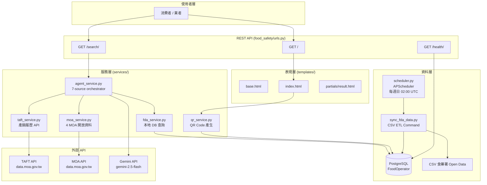
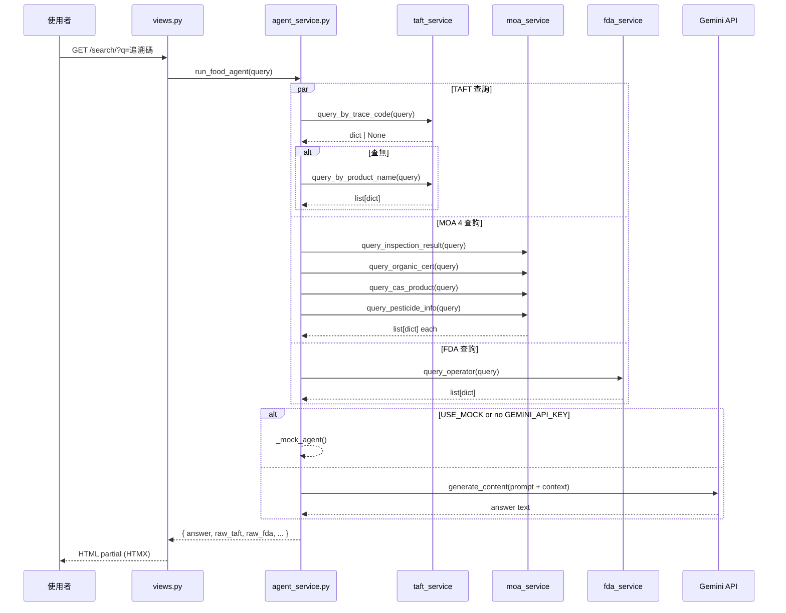
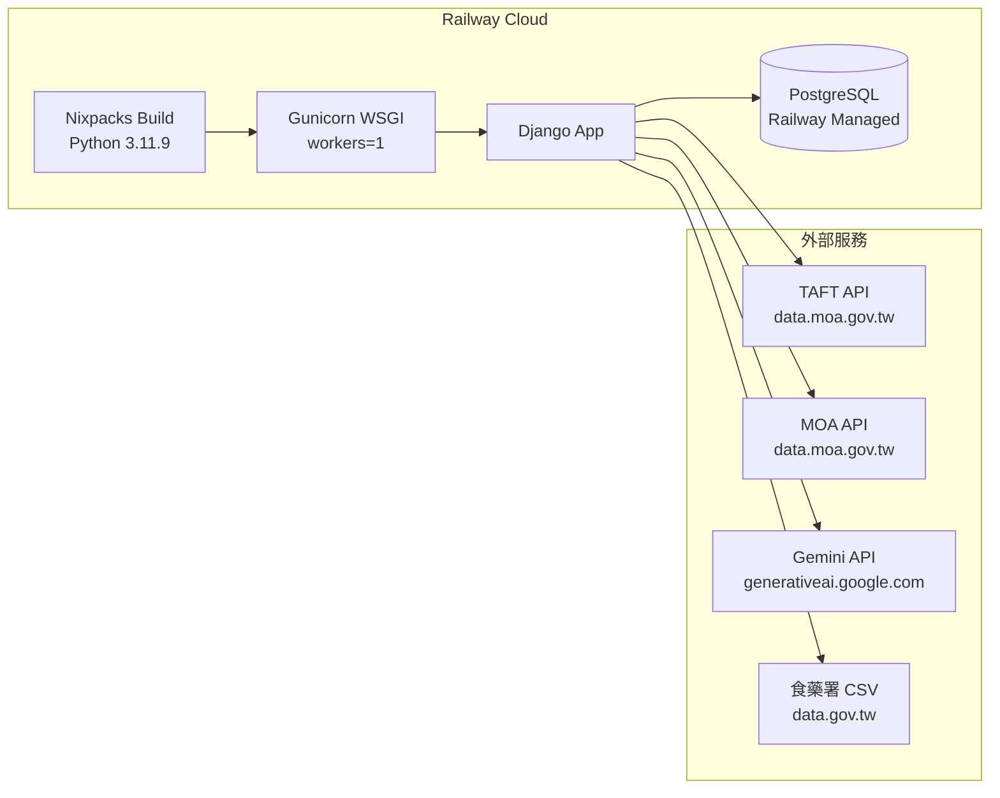

# 系統架構 — Due Diligence Package

## 模組邊界圖 (Mermaid)

## 資料流圖

## 部署拓撲

## 模組依賴關係

| 模組 | 依賴 | 外部依賴 |
|---|---|---|
| `views.py` | agent_service, qr_service | — |
| `agent_service.py` | taft_service, moa_service, fda_service | Gemini API (`google-genai`) |
| `taft_service.py` | — | data.moa.gov.tw, `tenacity` retry |
| `moa_service.py` | — | data.moa.gov.tw, `tenacity` retry |
| `fda_service.py` | models.FoodOperator | PostgreSQL |
| `qr_service.py` | — | `qrcode[pil]` |
| `scheduler.py` | django-apscheduler, DjangoJobStore | PostgreSQL |
| `sync_fda_data.py` | models.FoodOperator | data.gov.tw CSV |

## 關鍵架構決策

1. **Mock 模式優先**: `USE_MOCK_API=True` 開發模式無需 API key，可完全離線開發
2. **錯誤隔離**: 每個外部 API 查詢獨立 try/except，單一來源失敗不影響其他
3. **重試策略**: tenacity 指數退避 (1s→2s→4s)，最多 3 次，僅重試網路/5xx 錯誤
4. **降級策略**: API 失敗回傳 None/[]，view 層顯示用戶友好錯誤
5. **資料新鮮度**: TAFT/MOA 即時查詢，FDA 每週同步 (最長 7 天延遲)
6. **LLM 安全**: Prompt 嚴格限縮為資料整理者，禁止自行推斷；顯示原始資料來源供用戶交叉比對
