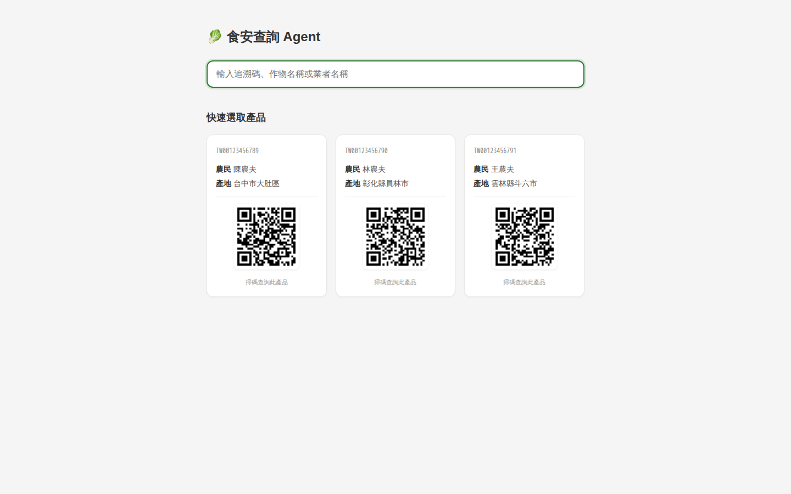
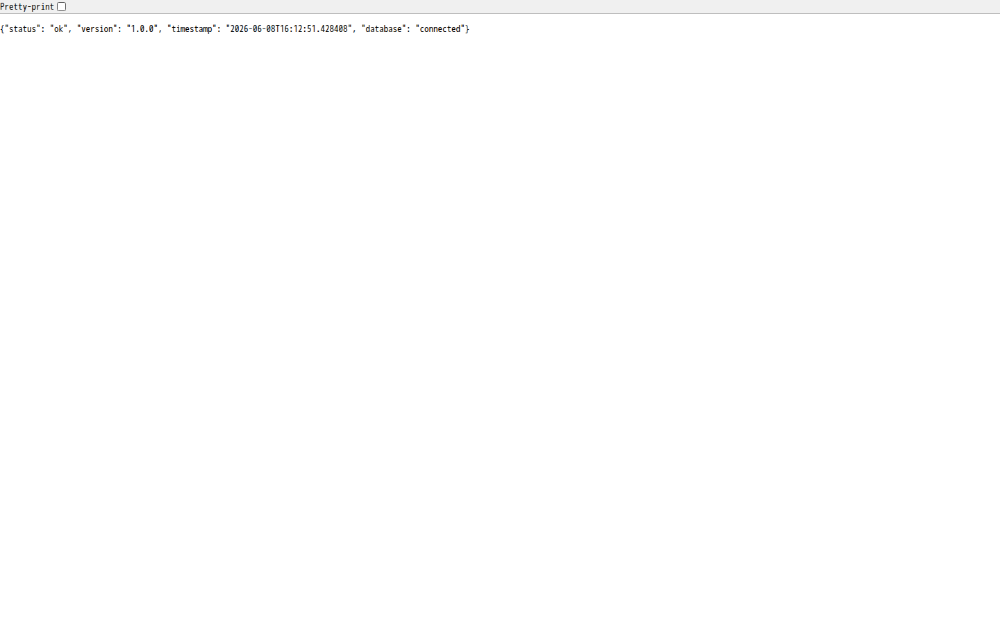

# 部署架構 — Due Diligence Package

## Platform: Railway

| 項目 | 值 |
|---|---|
| 平台 | Railway |
| Build 系統 | Nixpacks (自動偵測 Python/Django) |
| Python 版本 | 3.11.9 |
| WSGI Server | Gunicorn (bind `0.0.0.0:$PORT`) |
| 資料庫 | PostgreSQL (Railway Managed) |
| 靜態檔案 | Whitenoise (CompressedManifestStaticFilesStorage) |

## 部署配置

### railway.toml

```toml
[build]
builder = "nixpacks"

[deploy]
startCommand = "gunicorn config.wsgi:application --bind 0.0.0.0:$PORT"
restartPolicyType = "on-failure"
restartPolicyMaxRetries = 3
```

### Procfile

```
web: gunicorn config.wsgi:application --bind 0.0.0.0:$PORT
release: python manage.py migrate
```

> `release` phase 在每次部署時**自動執行 migration**，失敗則部署不生效。

### Runtime

```
python-3.11.9
```

## 環境變數與 Secrets 管理

| 變數 | 分類 | 說明 |
|---|---|---|
| `DJANGO_SECRET_KEY` | 🔐 Secret | Django 簽章密鑰 (50+ 隨機字元) |
| `GEMINI_API_KEY` | 🔐 Secret | Gemini API 金鑰 |
| `DATABASE_URL` | 🔐 Auto | Railway PostgreSQL 自動注入 |
| `USE_MOCK_API` | ⚙️ Config | 開發用 mock 開關 (正式: `False`) |
| `DJANGO_DEBUG` | ⚙️ Config | 正式: `False` |
| `DJANGO_ALLOWED_HOSTS` | ⚙️ Config | 限制可存取的主機 |
| `TAFT_API_BASE_URL` | ⚙️ Config | TAFT API 端點 |
| `TAFT_UNIT_ID` | ⚙️ Config | 預設 `063` |
| `FDA_DATASET_URL` | ⚙️ Config | 食藥署 CSV 網址 |
| `START_SCHEDULER` | ⚙️ Config | APScheduler 啟停 |
| `GEMINI_MODEL` | ⚙️ Config | 預設 `gemini-2.5-flash` |

> Railway 使用 **Secret Variables** (部署時不會出現在 log)，非普通環境變數。

## Release 流程

```
git push → Nixpacks Build → Release Phase (migrate) → Deploy
                                    │
                                    ▼
                            python manage.py migrate
                            (自動執行，失敗不影響現行版本)
```

## 災備策略

| 項目 | 狀態 | 建議 |
|---|---|---|
| DB 自動備份 | ✅ Railway PostgreSQL 內建 | 每日自動備份，保留 7 天 |
| DB 跨區備份 | ❌ | 需要跨 Region replication (高 SLA 時) |
| 應用多副本 | ❌ | 目前 single instance (可橫向擴展) |
| 靜態檔案備份 | ✅ | Whitenoise + Railway storage |
| 設定備份 | ✅ | `railway.toml` + `Procfile` 在 git 中 |

## 擴展計畫

| 階段 | 擴展項目 |
|---|---|
| 流量成長 2x | Gunicorn workers: 2-4, 視記憶體調整 |
| 流量成長 10x | 加入 Redis 快取 TAFT/MOA 結果 (TTL 5min) |
| 流量成長 50x | Celery workers 取代 APScheduler, 多 instance |
| 全球部署 | 多 region Railway 部署, CDN 靜態檔 |

## 監控與 SLA

| 指標 | 目標 | 測量方式 |
|---|---|---|
| 正常運行時間 | 99.5% | Railway Uptime |
| API P95 延遲 | < 2s | Prometheus + Grafana |
| 搜尋成功率 | > 99% | `/health/` endpoint |
| 資料新鮮度 | ≤ 7 天 | FDA 每週同步 |

## Screenshots

### Deploy Configuration


### Health Check


### Mobile View

