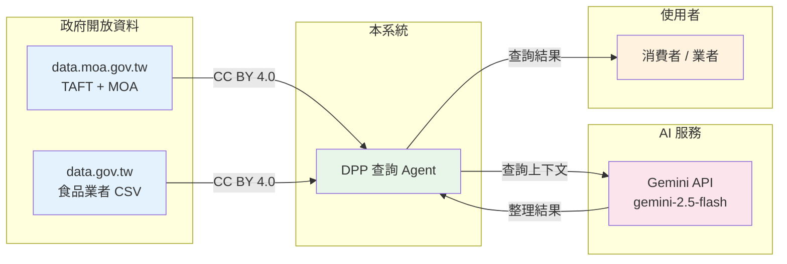

# 資料授權與合規聲明 — Due Diligence Package

## 資料來源授權

### 產銷履歷 (TAFT)

| 項目 | 說明 |
|---|---|
| 提供單位 | 農業部 |
| 平台 | data.moa.gov.tw |
| 授權條款 | 政府資料開放授權條款-第1版 |
| 使用限制 | 無需 API Key，可自由使用、轉載、改作 |
| 即時性 | 即時查詢 |
| 來源頁面 | https://data.gov.tw/dataset/7556 |

### 農業部開放資料 (MOA)

| 資料集 | 授權 | 限制 |
|---|---|---|
| 農藥殘留檢驗結果 | 政府資料開放授權條款-第1版 | 無 |
| 有機農產品驗證資訊 | 政府資料開放授權條款-第1版 | 無 |
| CAS 優良農產品查詢 | 政府資料開放授權條款-第1版 | 無 |
| 農藥毒性資料庫 | 政府資料開放授權條款-第1版 | 無 |

### 食品業者登錄 (FDA)

| 項目 | 說明 |
|---|---|
| 提供單位 | 衛生福利部食品藥物管理署 |
| 平台 | data.gov.tw |
| 授權條款 | 政府資料開放授權條款-第1版 |
| 使用限制 | 無需 API Key，可自由使用 |
| 更新頻率 | 每週同步 (非即時 API) |

### Gemini API

| 項目 | 說明 |
|---|---|
| 提供者 | Google AI |
| 使用條款 | Google AI Prohibited Use Policy |
| 資料處理 | 查詢內容傳送至 Google 伺服器處理 |
| 資料留存 | 依 Google 政策 (不會用於模型訓練) |

## PDPA / 個人資料保護法 合規

| 要求 | 狀態 | 說明 |
|---|---|---|
| 資料最小化 | ✅ | 僅查詢農產品追溯資料與業者登錄資料 |
| 目的限制 | ✅ | 僅用於食品安全查詢 |
| 資料正確性 | ✅ | 資料來源為官方政府公開資料 |
| 儲存限制 | ✅ | 僅存 FoodOperator (business_id, name, category, address) |
| 安全性 | ✅ | 無收集使用者個人資料 |
| 跨境傳輸 | ⚠️ | Gemini API 查詢可能跨境 (依 Google 條款) |

> **本系統不收集、不儲存、不處理任何使用者個人資料。**
> 所有查詢操作皆為讀取政府開放資料，無需使用者註冊或登入。

## 免責聲明

1. **資料準確性**: 系統顯示之資料源自政府公開平台，本系統不保證資料即時性與正確性
2. **AI 回應**: Agent 回答僅為資料整理，不構成食品安全保證或法律建議
3. **使用責任**: 使用者應自行判斷查詢結果，必要時向認證機構確認

## 資料利用圖

> 所有政府資料皆依 **政府資料開放授權條款-第1版** 授權使用。
> 使用者無需註冊，系統不留存個人資料。
