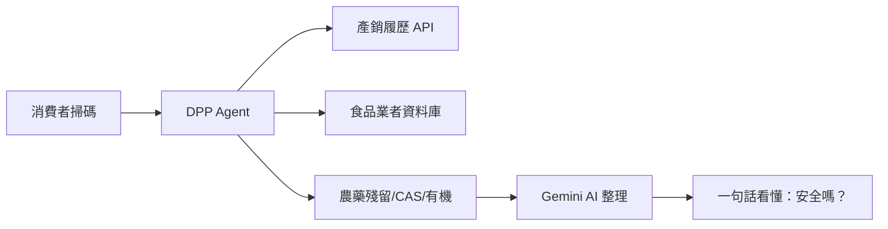

# 食安 DPP 查詢 Agent
## 數位產品護照 × AI Agent × 食品安全

### 讓每一口食物都值得信賴

---

# 問題：台灣食品信任赤字

- **資訊不對稱**：消費者掃條碼只能看到價格，看不到來源
- **查詢破碎**：產銷履歷、食品業者登錄、農藥檢驗分散在不同系統
- **業者痛點**：有驗證但消費者看不到 → 無法轉換為品牌溢價

> 「台灣有世界級的農產品驗證制度，但消費者感受不到。」

---

# 解決方案：AI 食安查詢 Agent

- **輸入**：追溯碼、作物名稱、業者名稱
- **輸出**：自然語言風險摘要 + 原始資料來源
- **體驗**：HTMX 即時查詢，500ms 延遲防抖

---

# 市場規模

| 市場 | 規模 | 成長率 |
|---|---|---|
| 台灣農產品產值 | NT$5,000 億/年 | 穩定 |
| 台灣食品零售 | NT$1.2 兆/年 | CAGR 3.5% |
| 全球食品透明市場 | $180 億 (2030) | CAGR 12.1% |
| 台灣溯源農產品 | 約 3.5 萬戶農民 | 年增 15% |

**目標市場**：優先切入台灣溯源農產品供應鏈（3.5 萬戶農民 + 2,000 家食品業者）

---

# 產品優勢

### 🎯 資料聚合者，不是知識生成者
- 串接 7 個官方資料來源（TAFT / MOA / FDA）
- AI 僅做整理，不做推斷 → **零幻覺設計**
- 每筆回答標註來源，使用者可展開原始資料

### 🚀 技術輕量
- Django + HTMX：無前端框架負擔
- PostgreSQL + APScheduler：資料自動同步
- 可部署在 Railway，月成本 < $20

### 🔗 數位產品護照 (DPP) 相容
- QR Code 嵌入產品包裝
- 消費者一掃即查
- 符合歐盟 DPP 標準趨勢

---

# 商業模式

## Phase 1：試點補貼（現在 — 3 個月）
- 免費提供中小型農企業使用
- 收集使用數據與滿意度

## Phase 2：SaaS 訂閱（3 — 12 個月）
- **基礎版**：查詢 API + 產品頁 Widget
  - NT$1,500/月
- **專業版**：異常偵測 + 召回模擬
  - NT$5,000/月
- **企業版**：客製 DPP 整合 + API 白標
  - 議價

## Phase 3：資料授權（12 個月+）
- 匿名化供應鏈數據給研究機構 / 保險公司
- 預估 ARR 佔比：30%

---

# 獲客策略

### 供給側（農企業）
- 透過農會系統合作推廣
- 提供免費 QR Code 貼紙（內嵌查詢入口）
- 協助符合歐盟 DPP 法規 = 出口競爭力

### 需求側（消費者）
- 搜尋引擎曝光（「這個農藥安全嗎？」）
- 與有機店 / 里仁等通路合作
- 口碑效應：查過信任，分享社群

---

# 競爭分析

| 面向 | 我們 | 傳統溯源平台 | 一般食安網站 |
|---|---|---|---|
| 查詢方式 | 自然語言 | 制式表單 | 靜態文章 |
| 資料廣度 | 7 個資料源 | 單一來源 | 無 |
| AI 應用 | Gemini 整理 | 無 | 無 |
| 部署成本 | 極低 | 高（客製開發） | 中 |
| 擴展性 | SaaS 模式 | 專案制 | 無 |

---

# 技術亮點

### 資料層
- **TAFT API**：農業部產銷履歷（即時）
- **MOA API**：農藥殘留 / 有機 / CAS / 農藥資訊（4 端點）
- **FDA DB**：食品業者登錄（每週 APScheduler 同步）

### AI 層
- **Gemini 2.5 Flash**：低延遲、高品質
- **Prompt 硬限制**：系統提示禁止推斷
- **Mock 模式**：開發無需 API Key

### 可靠度
- **Retry + Exponential Backoff**（tenacity）
- **Health Endpoint**：`/health/` 含 DB 連線檢查
- **76 個測試案例**：覆蓋 view / service / sync / agent error path

---

# 里程碑

| 時間 | 里程碑 | 關鍵指標 |
|---|---|---|
| Month 1-2 | MVP 上線 | 完成 76 tests, Railway 部署 |
| Month 3 | 試點 5 家農企業 | 月查詢 > 1,000 次 |
| Month 6 | 試點 20 家 | NPS > 50, 續約率 > 80% |
| Month 9 | SaaS 正式推出 | MRR > NT$100K |
| Month 12 | B2B API 授權 | ARR > NT$500K |

---

# 團隊

- **技術**：Django 全端開發，熟悉 Gemini API / HTMX / PostgreSQL
- **領域**：食品安全 + 數位產品護照 (DPP) 專業知識
- **已交付**：
  - 完整測試套件（76 tests）
  - 生產環境部署腳本（Railway）
  - 7 個資料源查詢引擎

---

# 募資需求

### 募資金額：**NT$300 萬**（約 $100K USD）

### 資金用途
| 項目 | 佔比 |
|---|---|
| 工程師薪資（2 人 × 6 個月） | 50% |
| 伺服器 + API 費用 | 10% |
| 試點推廣（農會合作） | 25% |
| 法規顧問（DPP 合規） | 15% |

### 預計 12 個月達損益兩平

---

# 聯絡我們

### 食安 DPP 查詢 Agent

📧 **Email**：team@foodsafety-dpp.tw  
🌐 **Demo**：[https://foodsafety-dpp.railway.app](https://foodsafety-dpp.railway.app)  
📖 **Docs**：[github.com/your-org/food-safety-dpp](https://github.com/your-org/food-safety-dpp)

---

> **願景**：讓台灣農產品的每一份用心，都能被消費者看見。
